# Binary Feature Extraction — Decision Logic


**Step types:**
- NEG — Negation guard: if true, returns `0` immediately
- NUM — Numeric threshold: compares a measured value to a clinical threshold
- TXT — Text pattern: regex search for lexical patterns
- DEFAULT — Fallback if no previous step matched

---

## 1. Right Heart

### `pacemaker`
**Section:** RV - FINDINGS - TV

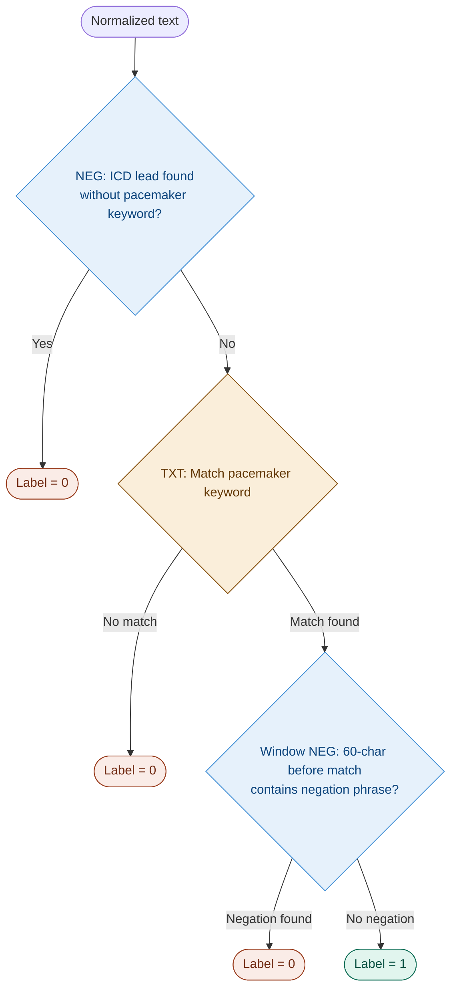

---

### `rv_systolic_function_depressed`
**Section:** RV — Label=1 only for moderate and above dysfunction

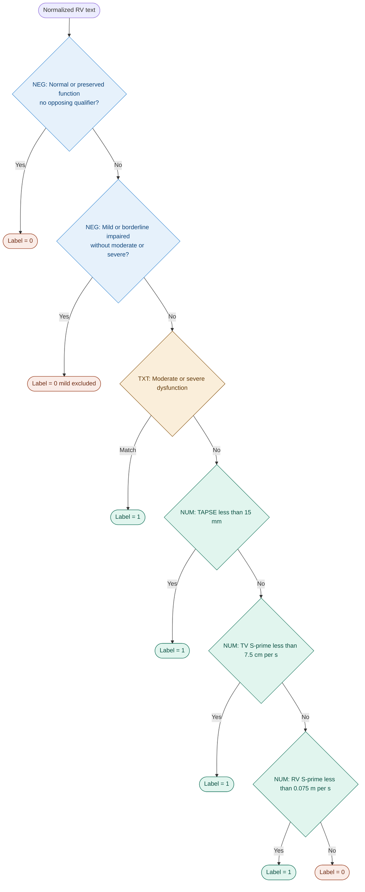

---

### `right_ventricle_dilation`
**Section:** RV — Text-only, no numeric path

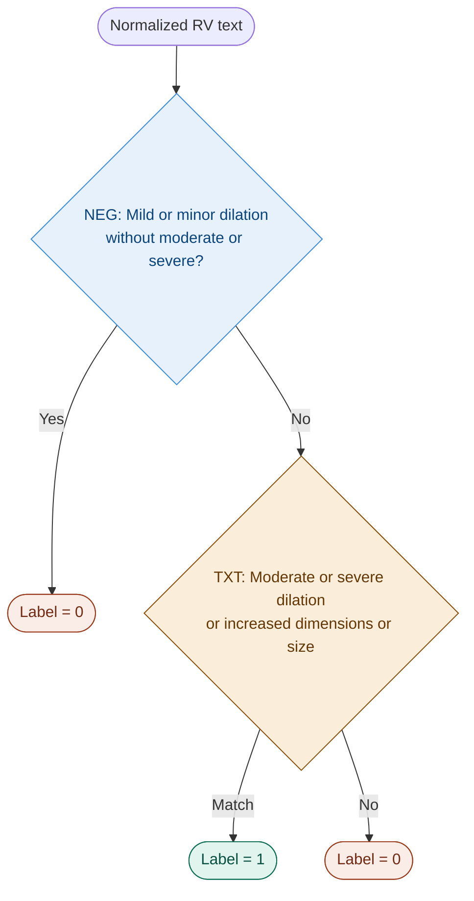

---

### `right_atrium_dilation`
**Section:** RA — 4 negation guards before positive patterns

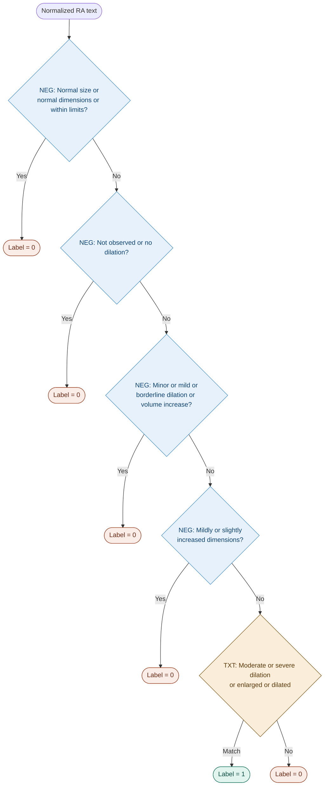

---

## 2. Left Atrium

### `left_atrium_dilation`
**Section:** LA — Text-only, 3 negation guards

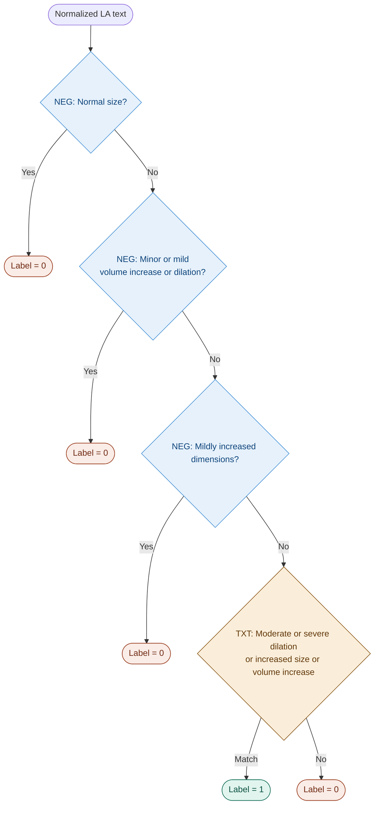

---

## 3. Mitral Valve

### `mitraclip`
**Section:** MV

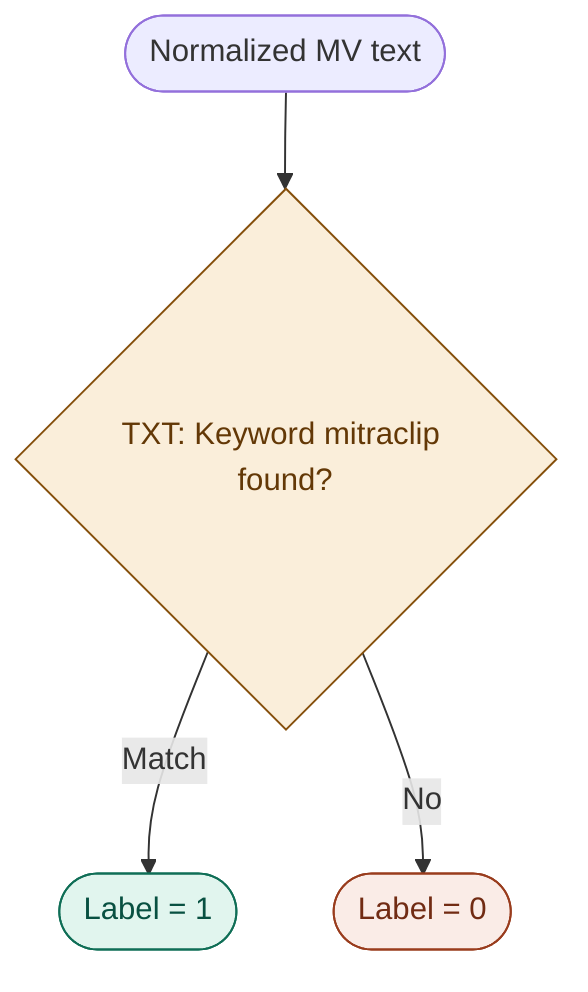

---

### `mitral_annular_calcification`
**Section:** MV

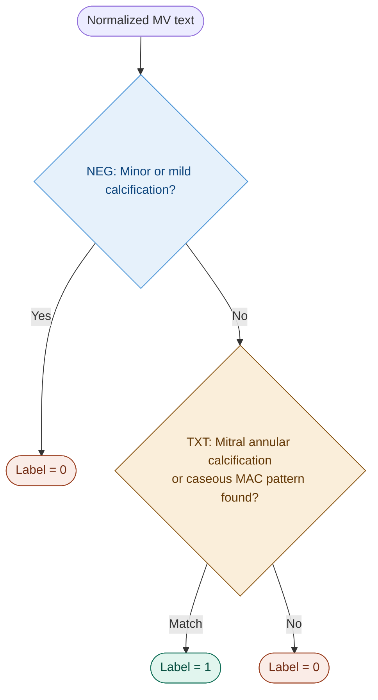

---

### `mitral_stenosis`
**Section:** MV — Thresholds: ESC 2021

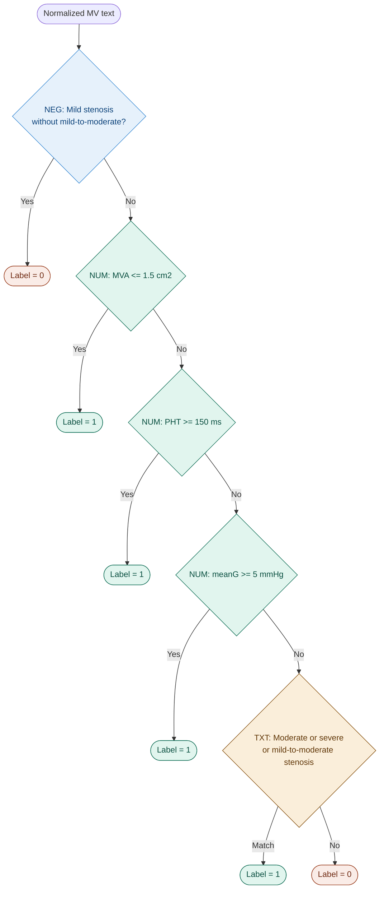

---

### `mitral_regurgitation`
**Section:** MV

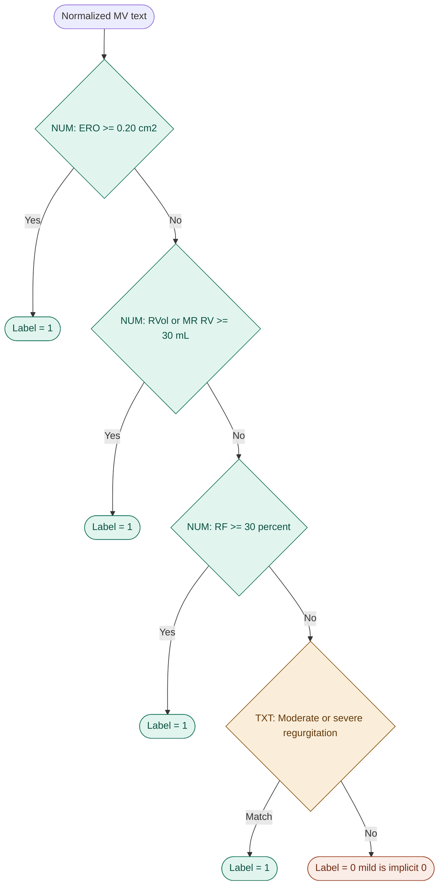

---

## 4. Aortic Valve

### `tavr`
**Section:** AV

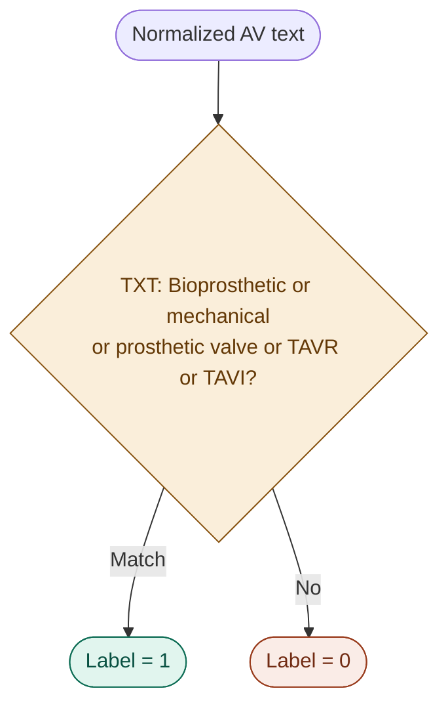

---

### `bicuspid_aov`
**Section:** AV — Natural bicuspid vs mechanical bileaflet

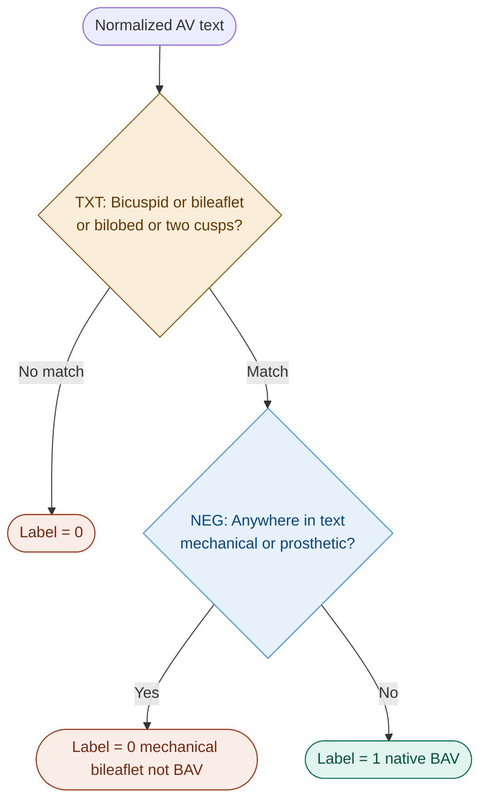

---

### `aortic_stenosis`
**Section:** AV — Thresholds: ESC 2021

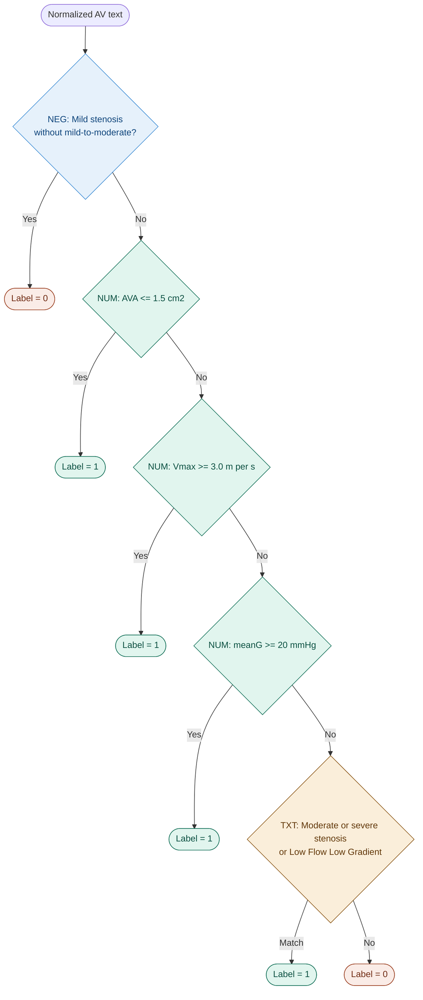

---

### `aortic_regurgitation`
**Section:** AV — AR PHT has an inverse threshold: lower value = worse regurgitation

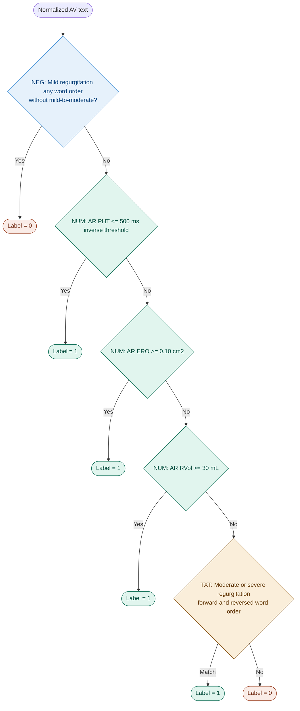

---

### `tricuspid_valve_regurgitation`
**Section:** TV — Text-only, no numeric path

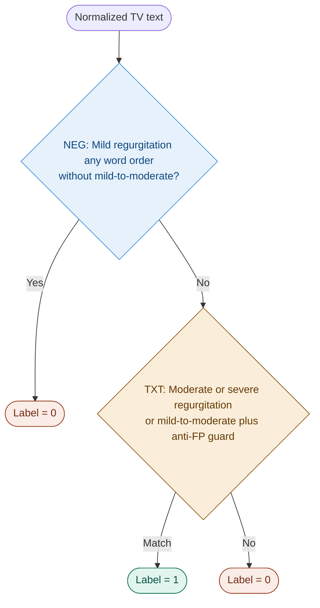

---

## 5. Aorta / Pericardium / IVC

### `aortic_root_dilation`
**Section:** AORTA — Threshold: >= 45 mm

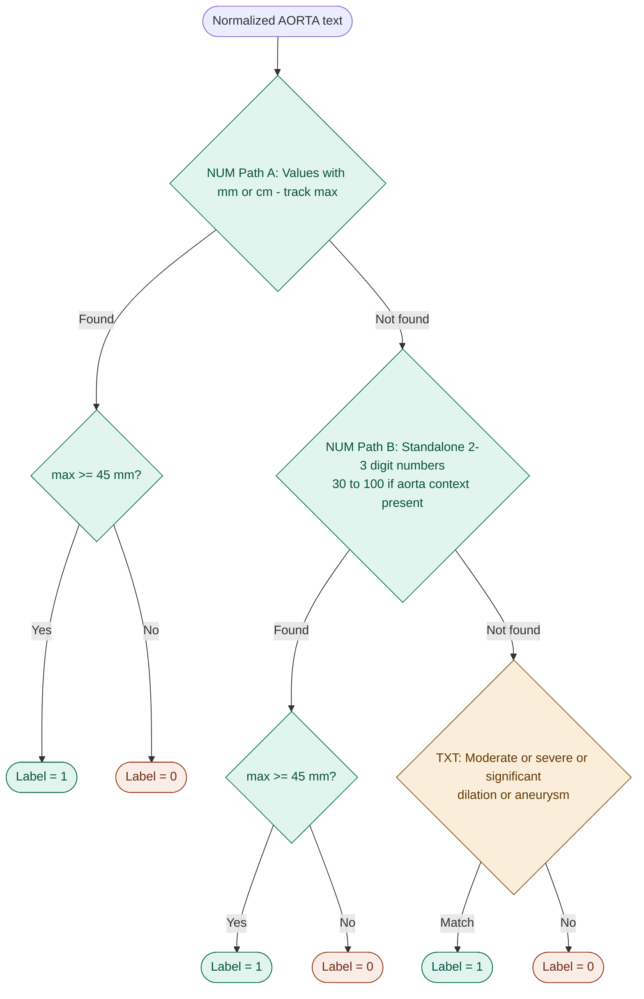

---

### `pericardial_effusion`
**Section:** PERICARDIUM — Threshold: >= 20 mm — Masks pleural effusions and fat

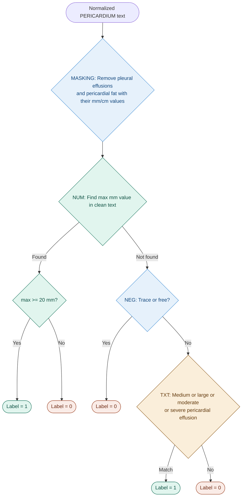

---

### `dilated_ivc`
**Section:** IVC — Threshold: > 21 mm — Excludes mmHg values

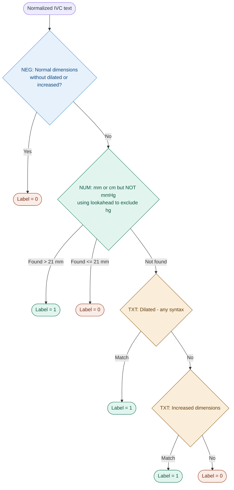

---

## Common NLP Patterns

### Accent-Insensitive Regex
Every Greek vowel is written as a character class matching both accented and unaccented forms:

| Class | Matches |
|---|---|
| `[έε]` | accented and unaccented e |
| `[ίι]` | accented and unaccented i |
| `[άα]` | accented and unaccented a |
| `[ήη]` | accented and unaccented i (eta) |
| `[όο]` | accented and unaccented o |
| `[ύυ]` | accented and unaccented u |
| `[ώω]` | accented and unaccented o (omega) |

### Window-based Negation
Checks the 60 characters **before** a keyword match for negation phrases like "not found" or "without".

### Numeric Unit Handling
```python
val = float(m.group(1).replace(',', '.'))  # comma to dot decimal
if unit == 'cm': val *= 10                  # convert cm to mm
# Exclude mmHg using (?!hg) lookahead
```
