# Binary Feature Extraction — Decision Logic

> Αυτό το README εξηγεί αποκλειστικά **πώς εξάγεται κάθε binary feature** από το NLP pipeline. Κάθε διάγραμμα δείχνει τα βήματα απόφασης (negation guards → numeric thresholds → text patterns → default fallback).

**Σύμβολα:**
- 🔵 **NEG** — Negation guard: αν ισχύει, επιστρέφει αμέσως `0`
- 🟢 **NUM** — Numeric threshold: συγκρίνει αριθμητική τιμή με κλινικό threshold
- 🟡 **TXT** — Text pattern: regex αναζήτηση λεκτικών patterns
- 🔴 **DEFAULT** — Fallback αν κανένα προηγούμενο βήμα δεν "έπιασε"

---

## 1. Right Heart

### `pacemaker`
**Section:** RV · FINDINGS · TV

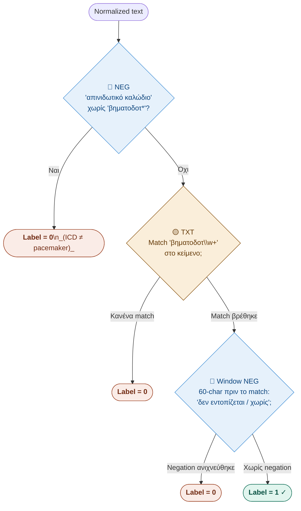

---

### `rv_systolic_function_depressed`
**Section:** RV | Label=1 μόνο για **μέτρια και άνω** δυσλειτουργία

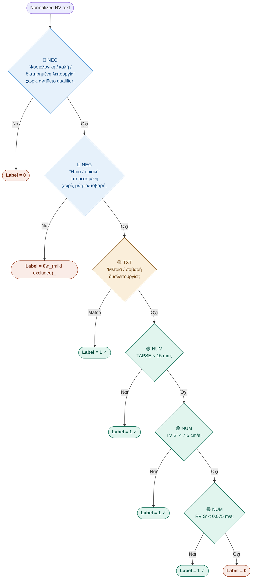

---

### `right_ventricle_dilation`
**Section:** RV | Text-only, χωρίς numeric path

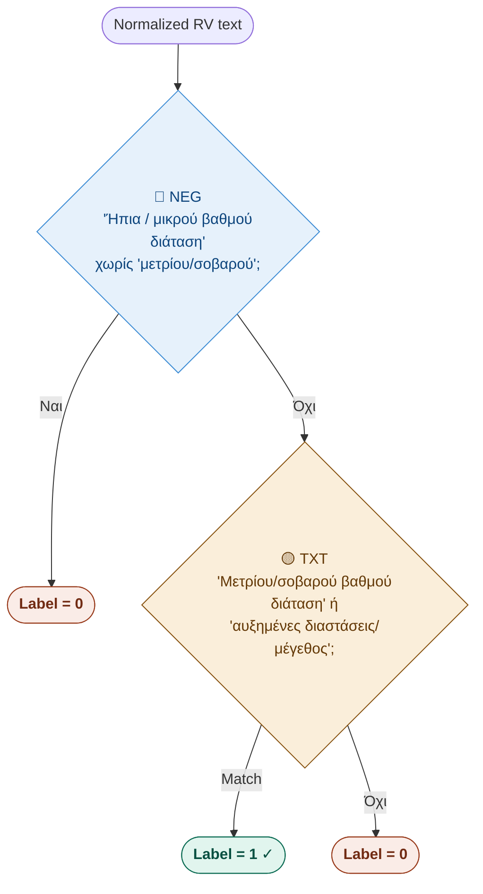

---

### `right_atrium_dilation`
**Section:** RA | 4 negation guards πριν τα θετικά patterns

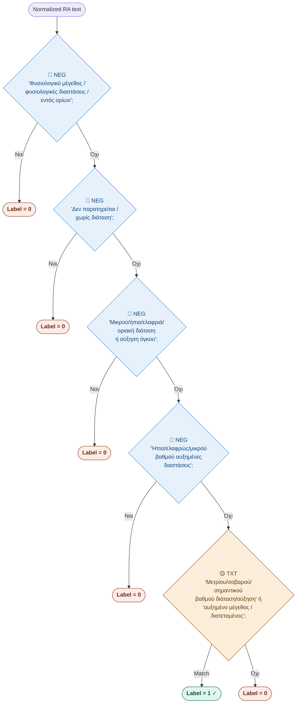

---

## 2. Left Atrium

### `left_atrium_dilation`
**Section:** LA | Text-only, 3 negation guards

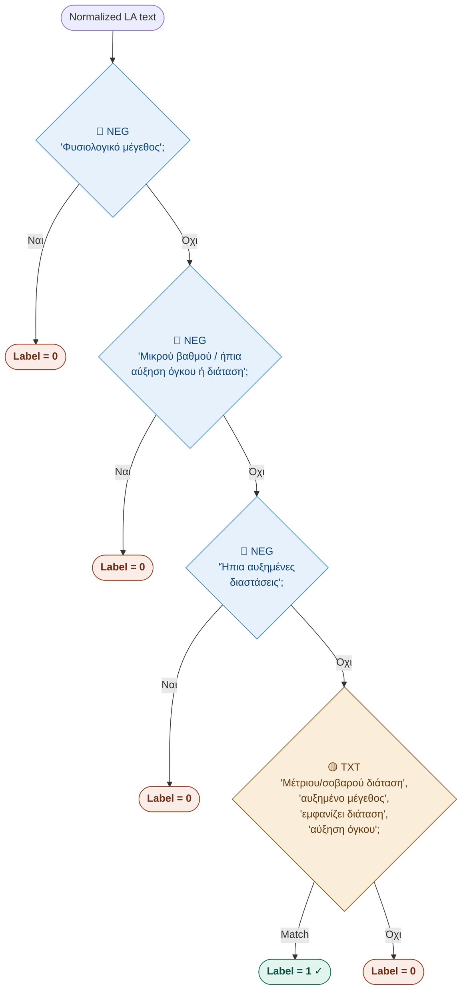

---

## 3. Mitral Valve

### `mitraclip`
**Section:** MV

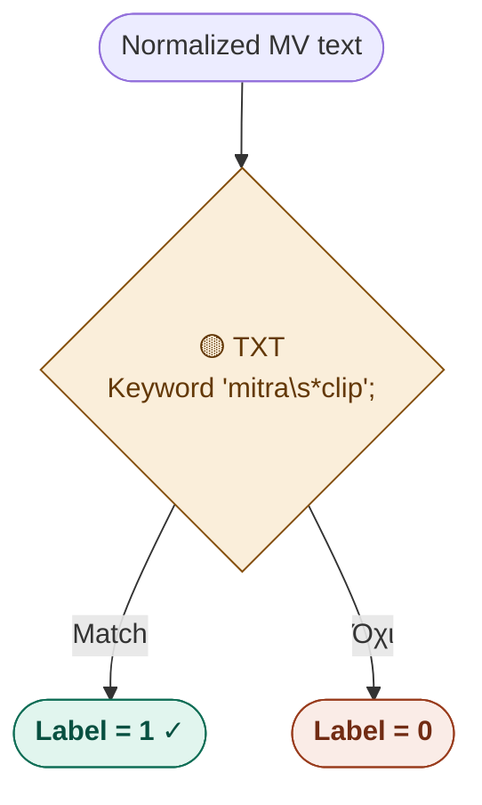

---

### `mitral_annular_calcification`
**Section:** MV

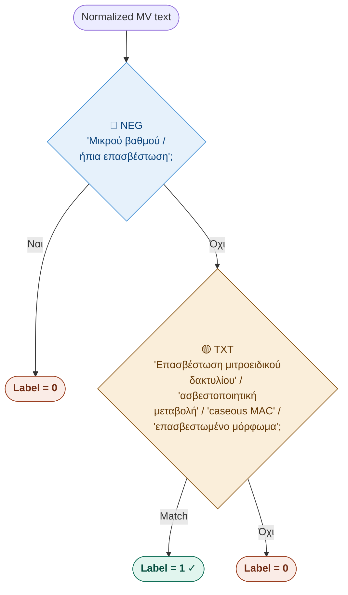

---

### `mitral_stenosis`
**Section:** MV | Thresholds: ESC 2021

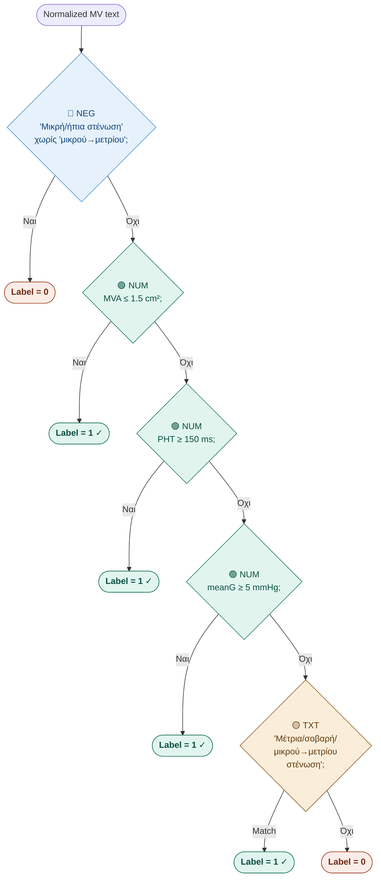

---

### `mitral_regurgitation`
**Section:** MV

```mermaid
flowchart TD
    A([Normalized MV text]) --> B{🟢 NUM\nERO ≥ 0.20 cm²;}
    B -->|Ναι| Z1(["`**Label = 1** ✓`"])
    B -->|Όχι| C{🟢 NUM\nRVol / MR RV ≥ 30 mL;}
    C -->|Ναι| Z1b(["`**Label = 1** ✓`"])
    C -->|Όχι| D{🟢 NUM\nRF ≥ 30%;}
    D -->|Ναι| Z1c(["`**Label = 1** ✓`"])
    D -->|Όχι| E{🟡 TXT\n'Μέτρια/σοβαρή\nανεπάρκεια/διαφυγή';}
    E -->|Match| Z1d(["`**Label = 1** ✓`"])
    E -->|Όχι| Z0(["`**Label = 0**`\n_(ήπια: implicit 0)_"])

    style Z0 fill:#FAECE7,stroke:#993C1D,color:#712B13
    style Z1 fill:#E1F5EE,stroke:#0F6E56,color:#085041
    style Z1b fill:#E1F5EE,stroke:#0F6E56,color:#085041
    style Z1c fill:#E1F5EE,stroke:#0F6E56,color:#085041
    style Z1d fill:#E1F5EE,stroke:#0F6E56,color:#085041
    style B fill:#E1F5EE,stroke:#0F6E56,color:#085041
    style C fill:#E1F5EE,stroke:#0F6E56,color:#085041
    style D fill:#E1F5EE,stroke:#0F6E56,color:#085041
    style E fill:#FAEEDA,stroke:#854F0B,color:#633806
```

---

## 4. Aortic Valve

### `tavr`
**Section:** AV

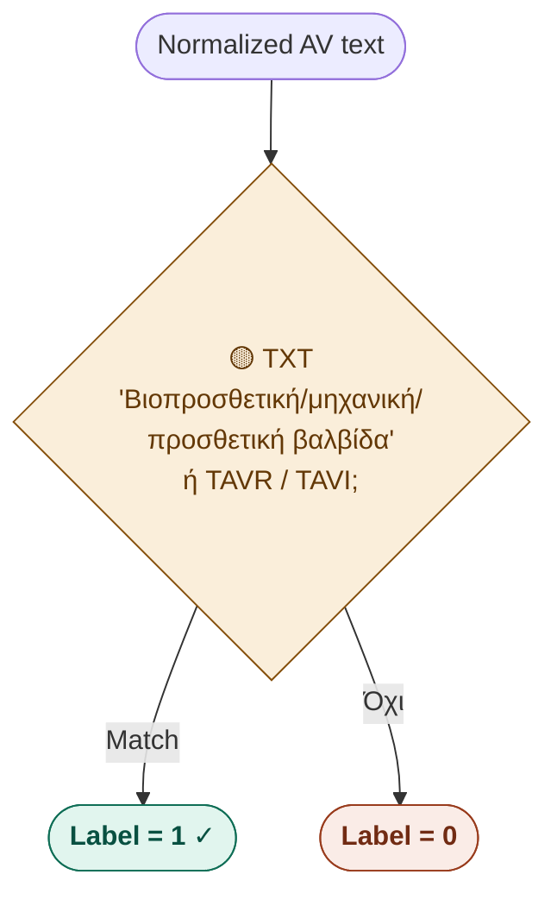

---

### `bicuspid_aov`
**Section:** AV | Κρίσιμη διάκριση: φυσική δίπτυχη ≠ μηχανική δίφυλλη

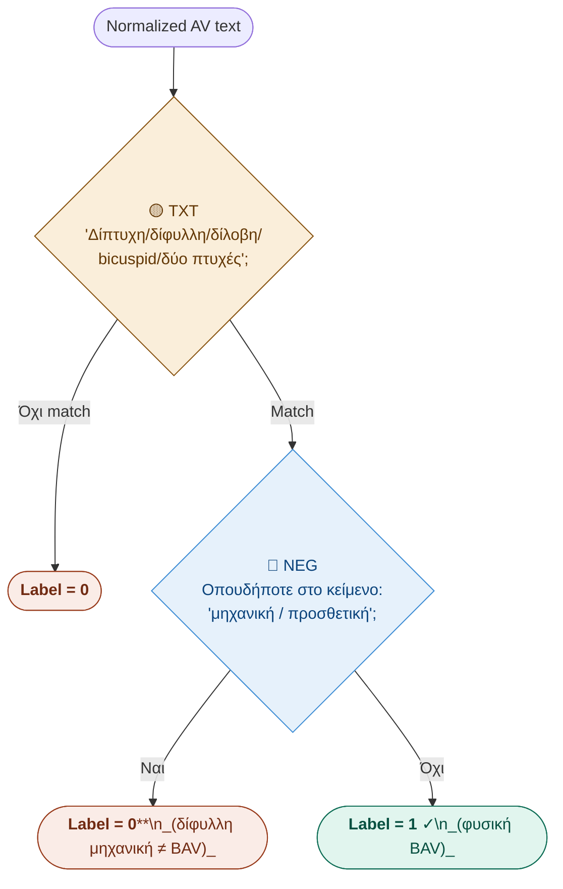

---

### `aortic_stenosis`
**Section:** AV | Thresholds: ESC 2021

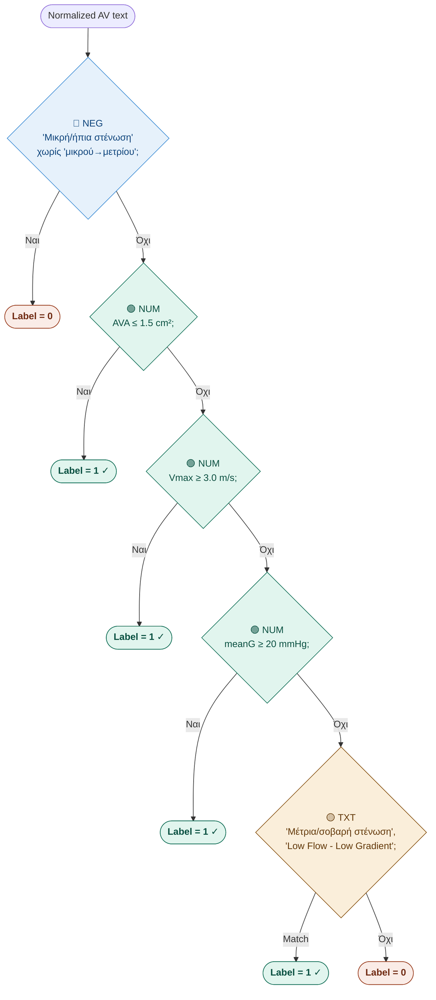

---

### `aortic_regurgitation`
**Section:** AV | Προσοχή: AR PHT έχει **αντίστροφο** threshold (μικρότερο = χειρότερο)

```mermaid
flowchart TD
    A([Normalized AV text]) --> B{🔵 NEG\n'Μικρή/ήπια ανεπάρκεια'\nοποιαδήποτε σειρά λέξεων\nχωρίς 'μικρού→μετρίου';}
    B -->|Ναι| Z0(["`**Label = 0**`"])
    B -->|Όχι| C{🟢 NUM\nAR PHT ≤ 500 ms;\n_(αντίστροφο threshold)_}
    C -->|Ναι| Z1(["`**Label = 1** ✓`"])
    C -->|Όχι| D{🟢 NUM\nAR ERO ≥ 0.10 cm²;}
    D -->|Ναι| Z1b(["`**Label = 1** ✓`"])
    D -->|Όχι| E{🟢 NUM\nAR RVol ≥ 30 mL;}
    E -->|Ναι| Z1c(["`**Label = 1** ✓`"])
    E -->|Όχι| F{🟡 TXT\n'Μέτρια/σοβαρή ανεπάρκεια/\nδιαφυγή' — κανονική +\nαντεστραμμένη σειρά;}
    F -->|Match| Z1d(["`**Label = 1** ✓`"])
    F -->|Όχι| Z0b(["`**Label = 0**`"])

    style Z0 fill:#FAECE7,stroke:#993C1D,color:#712B13
    style Z0b fill:#FAECE7,stroke:#993C1D,color:#712B13
    style Z1 fill:#E1F5EE,stroke:#0F6E56,color:#085041
    style Z1b fill:#E1F5EE,stroke:#0F6E56,color:#085041
    style Z1c fill:#E1F5EE,stroke:#0F6E56,color:#085041
    style Z1d fill:#E1F5EE,stroke:#0F6E56,color:#085041
    style B fill:#E6F1FB,stroke:#3B8BD4,color:#0C447C
    style C fill:#E1F5EE,stroke:#0F6E56,color:#085041
    style D fill:#E1F5EE,stroke:#0F6E56,color:#085041
    style E fill:#E1F5EE,stroke:#0F6E56,color:#085041
    style F fill:#FAEEDA,stroke:#854F0B,color:#633806
```

---

### `tricuspid_valve_regurgitation`
**Section:** TV | Text-only, χωρίς numeric path

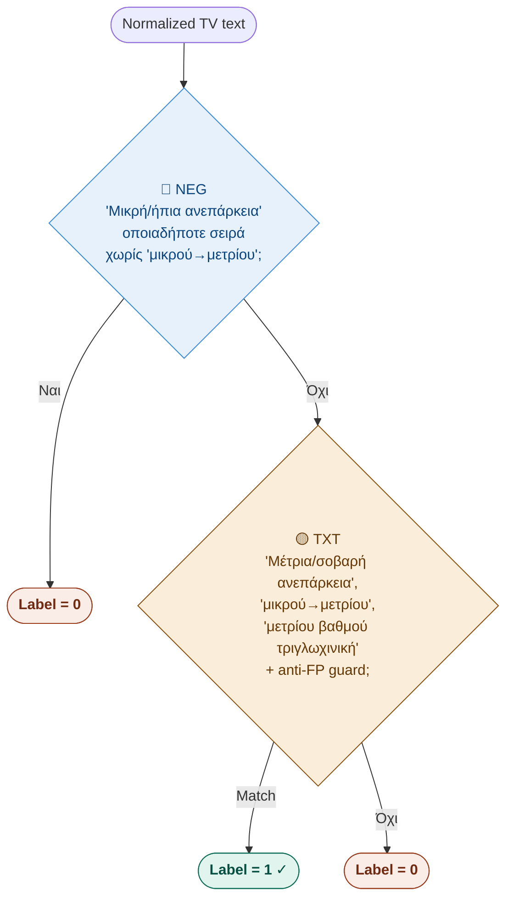

---

## 5. Αορτή / Περικάρδιο / ΚΚΦ

### `aortic_root_dilation`
**Section:** AORTA | Threshold: ≥ 45 mm

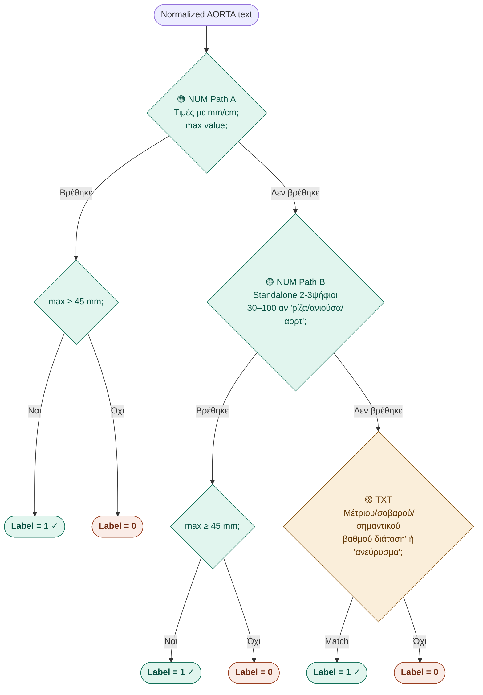

---

### `pericardial_effusion`
**Section:** PERICARDIUM | Threshold: ≥ 20 mm | Masking πλευριτικών/λίπους

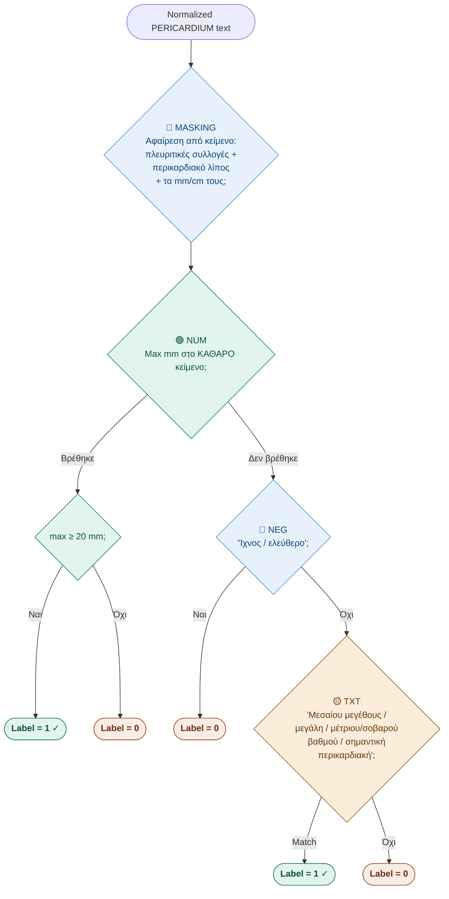

---

### `dilated_ivc`
**Section:** IVC | Threshold: > 21 mm | Αποκλεισμός mmHg

```mermaid
flowchart TD
    A([Normalized IVC text]) --> B{🔵 NEG\n'Φυσιολογικές διαστάσεις'\nχωρίς 'διατεταμένη /\nαυξημένες';}
    B -->|Ναι| Z0(["`**Label = 0**`"])
    B -->|Όχι| C{🟢 NUM\nmm/cm\nαλλά ΟΧΙ mmHg\n_'(?!hg)' lookahead_;}
    C -->|Βρέθηκε > 21 mm| Z1(["`**Label = 1** ✓`"])
    C -->|Βρέθηκε ≤ 21 mm| Z0b(["`**Label = 0**`"])
    C -->|Δεν βρέθηκε| D{🟡 TXT\n'Διατεταμένη'\nοποιαδήποτε σύνταξη;}
    D -->|Match| Z1b(["`**Label = 1** ✓`"])
    D -->|Όχι| E{🟡 TXT\n'Αυξημένες διαστάσεις';}
    E -->|Match| Z1c(["`**Label = 1** ✓`"])
    E -->|Όχι| Z0c(["`**Label = 0**`"])

    style Z0 fill:#FAECE7,stroke:#993C1D,color:#712B13
    style Z0b fill:#FAECE7,stroke:#993C1D,color:#712B13
    style Z0c fill:#FAECE7,stroke:#993C1D,color:#712B13
    style Z1 fill:#E1F5EE,stroke:#0F6E56,color:#085041
    style Z1b fill:#E1F5EE,stroke:#0F6E56,color:#085041
    style Z1c fill:#E1F5EE,stroke:#0F6E56,color:#085041
    style B fill:#E6F1FB,stroke:#3B8BD4,color:#0C447C
    style C fill:#E1F5EE,stroke:#0F6E56,color:#085041
    style D fill:#FAEEDA,stroke:#854F0B,color:#633806
    style E fill:#FAEEDA,stroke:#854F0B,color:#633806
```

---

## Κοινά NLP Patterns σε Όλα τα Features

### Accent-Insensitive Regex
Κάθε ελληνικό φωνήεν γράφεται ως character class που καλύπτει τονισμένη **και** άτονη γραφή:

| Class | Αντιστοιχεί σε |
|---|---|
| `[έε]` | `έ` (U+03AD) και `ε` |
| `[ίι]` | `ί` και `ι` |
| `[άα]` | `ά` και `α` |
| `[ήη]` | `ή` και `η` |
| `[όο]` | `ό` και `ο` |
| `[ύυ]` | `ύ` και `υ` |
| `[ώω]` | `ώ` και `ω` |

### Window-based Negation (`_has_negation`)
```
κείμενο: "... δεν εντοπίζεται βηματοδοτ* ..."
                [←  60 chars  →][  match  ]
```
Ελέγχει τα 60 chars **πριν** το match για: `δεν εντοπίζεται`, `δεν παρατηρείται`, `δεν υπάρχει`, `χωρίς`.

### Numeric Unit Handling
```python
val = float(m.group(1).replace(',', '.'))  # κόμμα → τελεία
if unit == 'cm': val *= 10                  # cm → mm
# Αποκλεισμός mmHg: (?!hg) lookahead
```
